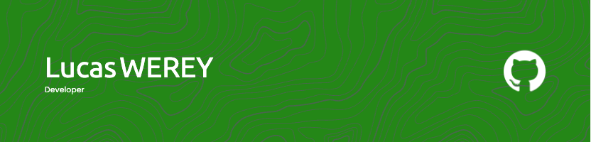

# Hello 👋, I'm Lucas WEREY

### Engineering student and web developer

- 🔭 I’m currently working on [End of study project](https://github.com/LucasWerey/Hook)

- 🌱 I’m currently learning **Rust**

- 📫 How to reach me **lucas.werey@hotmail.com**

## Connect with me:

## Skills 🚀

## Stats 📊

